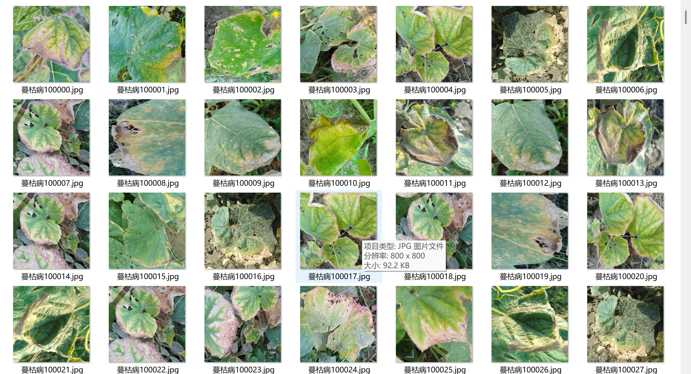
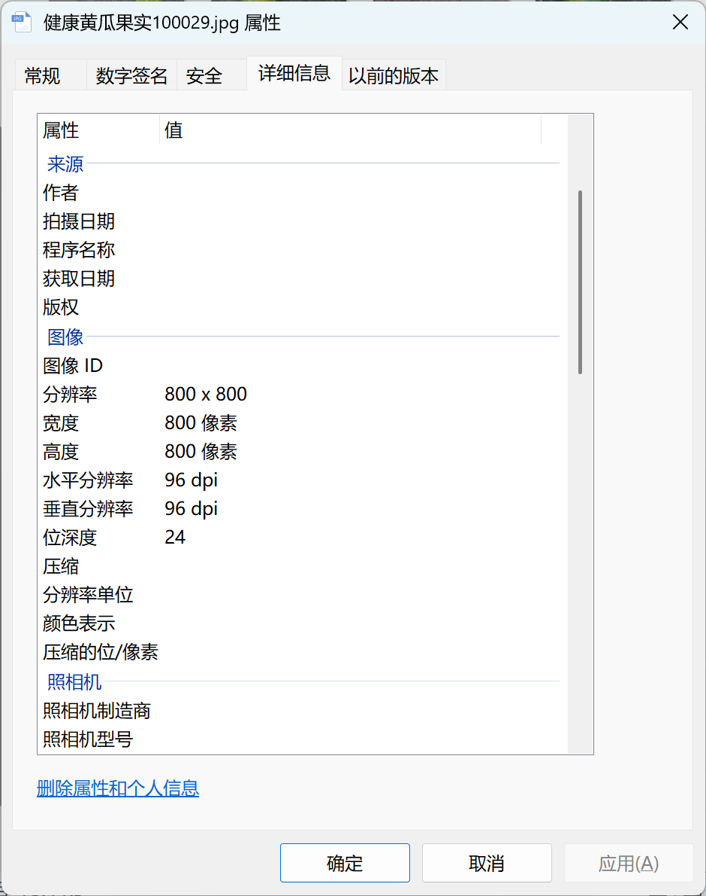

# Cucumber Fruit and Leaf Diseases - Image Classification Dataset

Dataset Information Introduction:
- Number of images in the Healthy Cucumber Leaves folder: 800
- Number of images in the Healthy Cucumber Fruits folder: 800
- Number of images in the Blight Disease folder: 800
- Number of images in the Erwinia Aphthophtora Rot Disease folder: 800
- Number of images in the Bacillus Wilfordii Disease folder: 800
- Number of images in the Sclerotinia Rot Disease folder: 800
- Number of images in the Verticillium Wilfordii Wilt Disease folder: 800
- Number of images in the Puccinia Strawberry Anthracnose Disease folder: 800
Total number of images in all subfolders: 6400

If you have questions, just add them to your message. I'm not under a friend verification, so you can send me messages directly without needing my permission. I can see it.
When searching for me, just finish sending all your questions at once. I will reply to you, sometimes I am busy, you describe clearly your questions and intentions.
I will also reply to you when I am free, no need for formalities, which is more efficient.
Your phone number is the same as above. If I forget to reply or you are impatient, you can text or call.

## Images

Here is a pay link on Stripe ( https://buy.stripe.com/3cs8yP7sY87d0vu9AB ). Please contact me lonlonago@foxmail.com after funding $89, and I will send you a complete data files , thank you!

